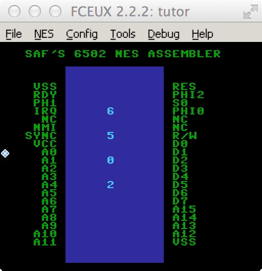

# N65 NES assembler

This is an assembler for the Nintendo Entertainment System's 2A03
microprocessor.  


The 2A03 is an 8-bit processor based on the MOS 6502.

 ```bash
   Usage: ./n65 <infile.asm> -o outfile.nes
 ```

  

  This is a pretty straightfoward assembler, which is currently set up
  to produce iNES formatted ROM binaries from 6502 assembly language files.

  <a href="http://irkenkitties.com/blog/2015/03/29/creating-sound-on-the-nes/">Here</a>
  is a recent blog post that goes through creating a program with this
  n65, showing the essential syntax and more.  Best thing until I create
  some real documentation.

  Inside An NES cartridge there are basically some number of ROM chips
  which contain banks of either program code or character (graphics) 
  data.  A PROG ROM bank is generally 16KB, and a CHAR ROM bank is generally
  8KB.  At least one PROG ROM bank is required, and the NES can address
  2 PROG ROM banks and 1 CHAR ROM bank without the use of a mapper.

  This assembler works on the idea of defining these banks, and allowing
  you to specify their contents.  When you then assemble your output ROM
  this assembler translates the assmebly code in your your PROG banks 
  into executable binary segments, and also lets you organize and address
  data in your CHAR banks.  In the end it jams all these banks together
  one after another, PROG first, then CHAR, and slaps an iNES header
  on the front of it.

  It is good at knowing which addressing modes are and are not allowed for 
  each instruction, and contains some examples of correct syntax.

  This assembler can now handle bankswitching if you set a 
  valid mapper in the header, write more than 2 PROG banks, and then 
  and write whatever bankswitching code is nessessary for the mapper
  you've chosen.

  This assembler supports symbolic labels which can be scoped.  When 
  writing assembly it can be easy to run out of effective names for 
  labels when they are scoped globally.  I have seen other assemblers
  using anonymous labels to get around this but I decided I didn't like
  that syntax very much.  Instead I opted to allow opening a new scope
  where you can reuse symbol names.  You can give scopes names or allow
  them to be anonymous.  If you choose to name a symbol scope you can
  use a dot syntax to address any symbols that are outside your current
  scope.  I should put some example code up here showing this.

  I hoped to make writing NES libraries more effective since you can basically
  namespace your symbols into your own file and not mess with anyone 
  else's code.  I also have also been able to use this to create C style 
  structs in the memory layout, ie `sprite.x`.

  The assembler does two passes over your code, any symbols that are used
  which it hasn't seen the definition for yet return a "promise", that 
  are stored for the second pass.  A "promise" is a fancy name for a 
  lambda/closure which promises to come up with a value later, while
  your code continues on.  It then evaluates all these "promises" during
  the assembler's second pass, which fills in the missing addresses etc.

  I have used this to compile some code for the NES, and it ran correctly
  on FCEUX, got it to make some sounds, load tiles, sprites, and scrolling.

  There is an example file included (shown below) that is a modified port of
  the NES101 tutorial by Michael Martin.

# Some new additions:
  - .byte can now handle hex and binary literals, and symbols
  - First version of Midi to NES music converter
  - added .inc directive, to include other .asm files
  - nes.asm library include file created, naming popular NES addresses
  - C Style in memory structs using .scope and .space directives
  - Explicit usage of zero page instructions with the zp suffix
  - Split the Parser into its own class
  - New MemorySpace class
  - Rewrote the Assembler class
  - Rewrote the Instruction class 
  - Rewrote all directive's classes
  - Split the assembler from the commandline front-end 
  - Scoped Symbol Table
  - Anonymous Scopes
  - Lower case mnemonics and hex digits
  - Ported NES101 tutor to this assembler.
  - Added msb and lsb byte selectors on address labels
  - added .org directive
  - added .dw directive
  - added .bytes directive
  - added .incbin directive
  - added .ascii directive
  - added .segment directive
  - added .scope directive
  - added .space directive
  - Invented my own iNES header directive that is JSON
  - Split the project up into separate files per class
  - Wrote some more unit tests
  - Added OptionParser for commandline opts
  - Tested a ROM with Sound output
  - Tested a ROM that changes background color

# Some Todos:
  - Make macros that can be used interchangably inline or as a subroutine
  - Create a library for common operations, DMA, sound, etc both inline and subroutine options
